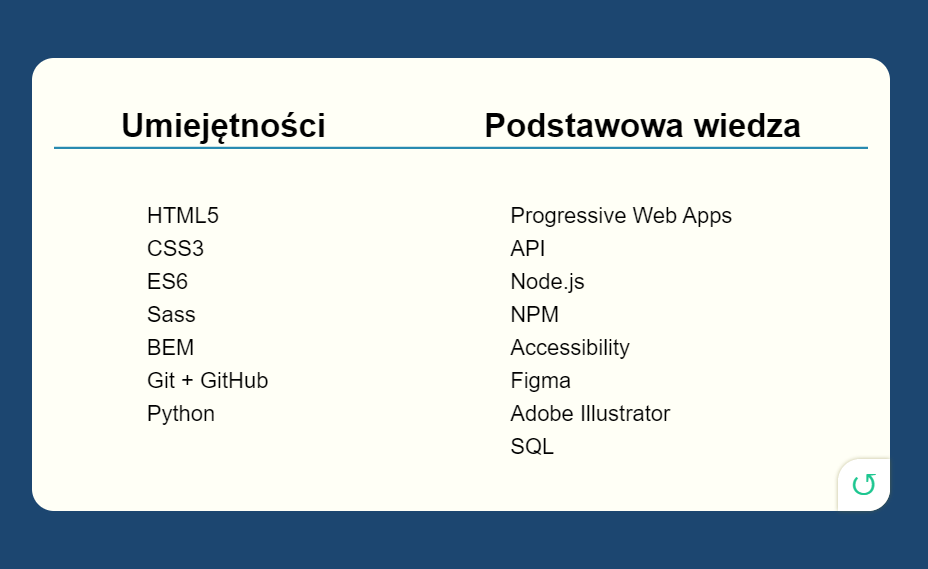

# Business Card

The aim of this project was to cut graphic designed in Figma and to convert it into HTML and CSS.

You can see the website [here](www.annamazurek.github.io/business-card).

# Used technologies and tools

- HTML5
- CSS3 (Flexbox, BEM, RWD)
- Sass (SCSS)
- JS
- Figma
- GIT

# Screenshots

